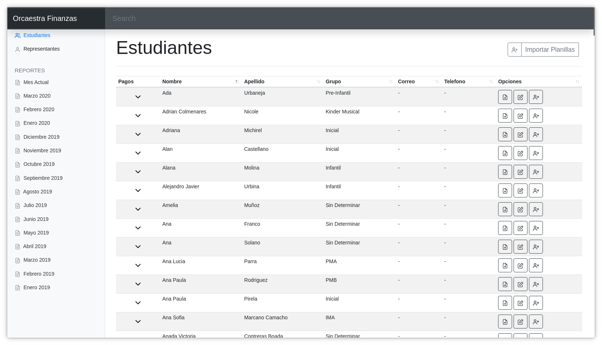
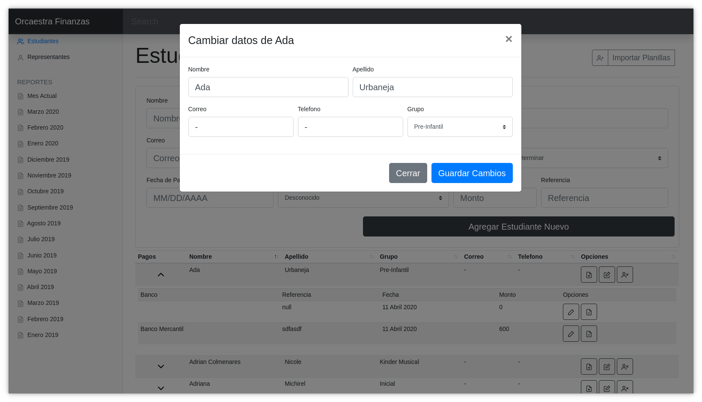
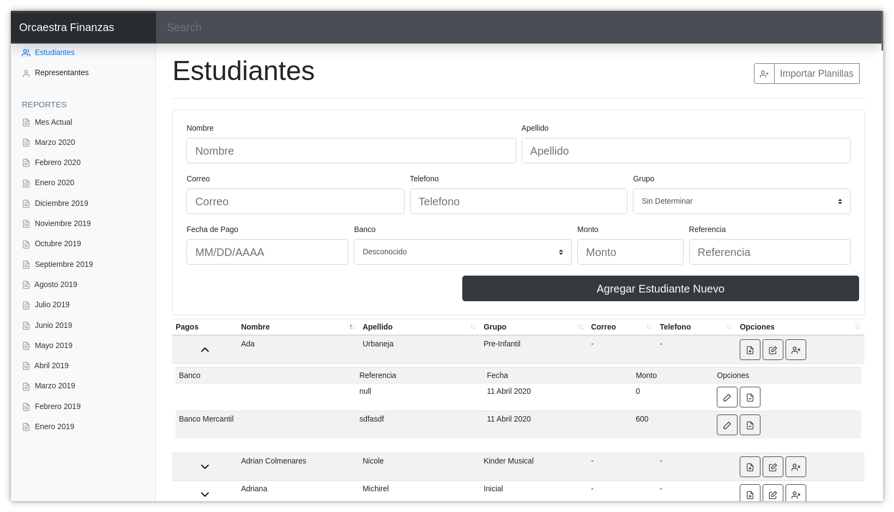
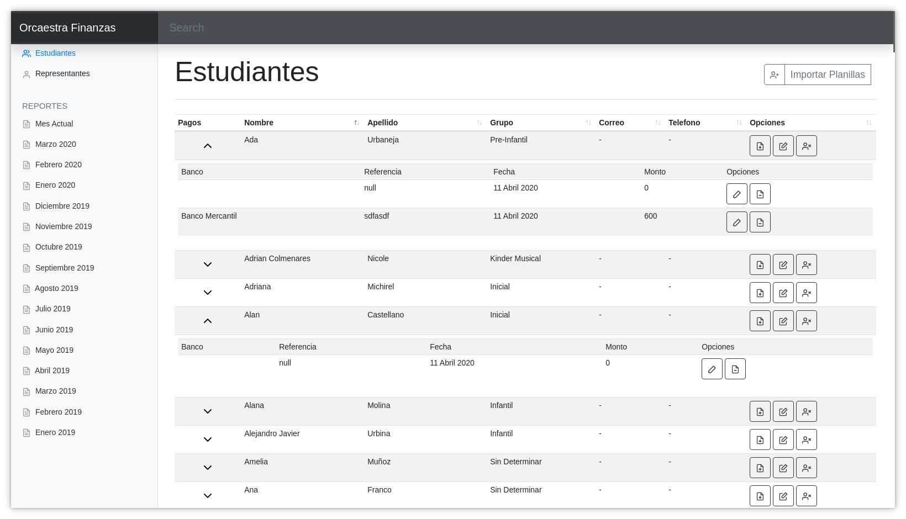

# Orcaestra Finanzas

Webapp made to keep control of the Donations made to the "Orquesta Sinfonica Juvenil e Infantil de Ciudad Guayana" part of the "National Network of Youth and Children's Orchestras of Venezuela".

## Getting Started

These instructions will get you a copy of the project up and running on your local machine for development and testing purposes. See deployment for notes on how to deploy the project on a live system.

### Description

The "Orquesta Sinfonica Juvenil e Infantil de Ciudad Guayana" the local orchestra for the youth is an NGO focused on teaching the kids from the surrounding community how to improve their lives through music and musical instruments free of charge. To pay the day to day costs of running an organization parents can donate any kind of amount to the foundation.

The logistics related to the donations the Orchestra had been organized with a system of spreadsheet files sorted by the month the donation was done. Orcaestra Finanzas (a wordplay based on the words "Orca Whale" and Orchestra and the word for Finances in Spanish) was presented as a solution to these problems.

Deployed on Heroku the Backend of Orcaestra Finanzas is an Express Server connected to the MongoDB database through the Mongoose ORM. Following a lightly implemented test-driven development methodology with the Mocha, Chai & Supertest libraries and surrounding the possibility of importing already existing spreadsheet files to populate the database. On the Frontend side, it leveraged its functionality with Bootstrap, JQuery, and [Datatables.net](http://datatables.net/)

### Screenshots






### Prerequisites

As the backend database is based on MongoDB, I used the Database-as-a-Service (DaaS) mLab, you can use any DaaS or your own MongoDb database.

### Installing

I stored the database addres in the enviroment variable ORCAESTRA_DB.

```
ORCAESTRA_DB="mongodb://USER@IP:PORT/YOUR_DB"
```

It is also recomended to store the port and IP to be used

```
PORT="PORT"
IP="YOUR_IP"
```

The app is ready to be used with nodemon

```
npm install
npm start
```

## Running the tests

The Mocha Tests included are made to test the REST Backend functionality, data models and excel processing capabilities and mapping.

## Deployment

Add additional notes about how to deploy this on a live system

## Built With

### Backend

- [SheetJS](https://sheetjs.com/) - Spreadsheets simplified
- [Express](https://expressjs.com/) - Fast, unopinionated, minimalist web framework for Node.js
- [mongoose](https://mongoosejs.com/) - elegant mongodb object modeling for node.js
- [Mocha](https://mochajs.org/) - the fun, simple, flexible JavaScript test framework

### Frontend

- [Bootstrap](https://getbootstrap.com/) - The most popular HTML, CSS and Javascript Library in the World.
- [jQuery](https://jquery.com/) - The Write Less, Do More, JavaScript Library.
- [DataTables](https://datatables.net/) - Advanced tables, instantly

## License

This project is licensed under the MIT License - see the [LICENSE.md](LICENSE.md) file for details
